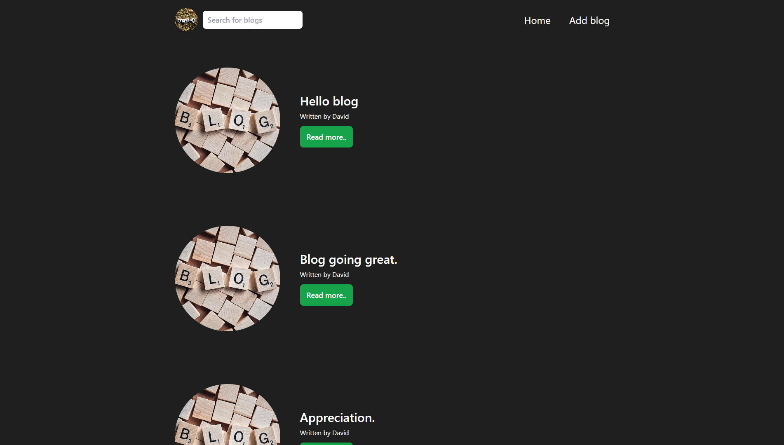
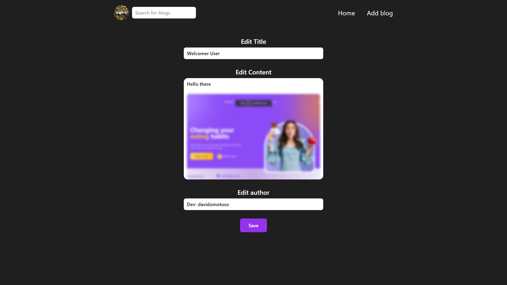
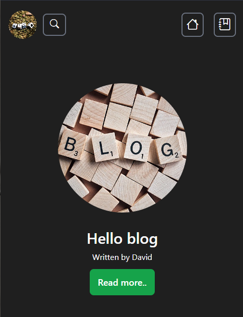

# The-Blog

A blogging website.

## Table of Contents

- Introduction

- Screenshots

- Installation

- Usage

- Technologies Used

- Features

- Contributinging

## Introdction

This project is a web application for managing blogs. It allows users to create, edit, view, and delete blog posts. The application provides features like searching for blogs and viewing detailed content of individual blog posts.

## Screenshots







## Installation

### Go to your terminal and run the following guidelines

1. Clone the repository:

   ```git
   git clone https://github.com/davidomotoso/The-Blog.git
   ```

2. Navigate to the project directory:

   ```cmd
   cd The-Blog
   ```

3. Install dependencies:

   ```node
   npm install
   ```

4. Start the development server:

   ```node
   npm start
   ```

5. Open your web browser and access the application at "<http://localhost:3000>".

### Move to a new terminal and run these command

1. Navigate to the project folder

   ```cmd
   cd The-Blog
   ```

2. Intialize json-server (as backend).

   ```node
   npx json-server --watch src/Blog/data/blog.json --port 4000
   ```

`Note: The default port for this project is 4000, you can change yours but remember to change the url's for fetching blogs.`

Then you can add your blog (`Remember the blog.json file is where all your inputs would go to`).

## Usage

- Home Page: Displays a list of blog posts. Users can click on the read more button to view its detailed content.

- New Blog: Allows users to create a new blog post. They can enter a title, content, author, and optionally upload an image or video.

- Blog Content: Shows the detailed content of a selected blog post, including text content and media (images or videos).

- Edit Blog: Enables users to edit the content of an existing blog post, including the title, content, and author.

## Technologies Used

- React: JavaScript library for building user interfaces.

- React Router: Library for handling routing within a React application.

- Tailwind CSS: CSS framework for designing responsive and user-friendly UI components.

- Bootstrap Icons: Free, high quality, open source icon library with over 1,800 icons.

- REST API: Used for communication between the frontend and backend.

- Node.js: JavaScript runtime for building server-side applications.

## Features

- Create new blog posts.

- Search for specific blog posts.

- Upload images and videos as part of blog content.

- Responsive design for various screen sizes.

## Contributing

Contributions are always welcomed! If you find any issues or have suggestions for improvements, feel free to open an issue or submit a pull request.

`Note: Json-server can not handle a video file(because of it's size), so your blog might not be uploaded when you try to put in a video.`
